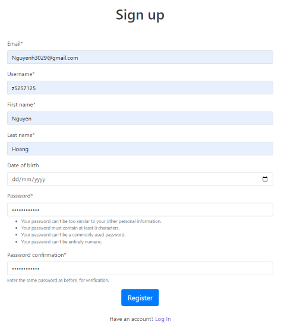
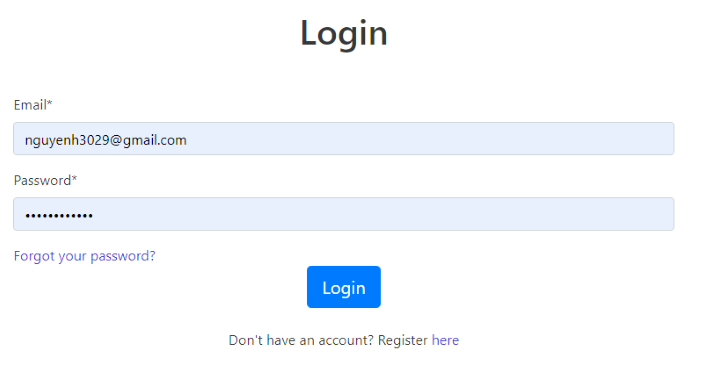

# Capstone-Project-3900-t11b-3-5

# Table of Contents

1. [Pre-Installation Checklist](#checklist)
   1. [Linux python install](#linux)
   2. [Windows python install](#windows)
2. [Setup](#setup)
3. [Virtual Environment Errors and How To Fix](#errors)
4. [Using the App (Workflow and Use Cases)](#using-app)
   1. [Login and Register](#login-register)
   2. [Forgot your password?](#forgot-pass)
   3. [Your Profile](#login-register)
      1. [Edit Profile](#edit-profile)
   4. [The Dashboard](#login-register)
      1. [Dashboard Tasks](#dashboard-tasks)
      2. [Dashboard Groups](#dashboard-groups)
   5. [Creating and Managing Tasks](#task-manage-create)
      1. [How to Create a Task](#create-task)
      2. [Task Edit](#task-edit)
      3. [Task Relations](#task-relations)
      4. [Task Help System](#task-help-system)
   6. [Managing Task Groups](#managing-task-groups)
      1. [Managing Members](#managing-members)
      2. [Sending Task Group Notifications](#group-notifications)
      3. [Deleting Task Group](#deleting-group)
   7. [Adding and Managing Friends](#friends)
      1. [Sending Friend Requests](#send-friend-request)
      2. [Viewing Friends List](#viewing-friends-list)

## Pre-Installation Checklist <a name="checklist"></a>

| Requirement  | Description                                                                         |
| ------------ | ----------------------------------------------------------------------------------- |
| Windows      | Developed and Tested on Windows 10 and 11                                           |
| MacOS        | Developed and Tested on MacOS Monterey                                              |
| Linux        | Tested on Ubuntu                                                                    |
| Python       | 3.8.10, (versions 3.9.X+ is recommended)                                            |
| Git          | [How to install Git](https://git-scm.com/book/en/v2/Getting-Started-Installing-Git) |
| Pip3         | [How to install Pip](https://pip.pypa.io/en/stable/installation/)                   |
| Python3-venv | [How to install python-venv](https://docs.python.org/3/library/venv.html)           |

> **Note**:  We have not tested on Python 3.10+

### If you do not have python 3.9.X, I recommend following these

**For Linux systems:**  <a name="linux"></a>

[How To Install Python 3.9](https://tecadmin.net/how-to-install-python-3-9-on-ubuntu-18-04/)

**For Windows or Mac:** <a name="windows"></a>

[Download Python 3.9](https://www.python.org/downloads/release/python-390/)

> **Note**: Use the respective download links for your operating system.

## Setup <a name="setup"></a>

Firstly, clone the repository and change to project directory:

```bash
git clone git@github.com:unsw-cse-comp3900-9900-22T2/capstone-project-3900-t11b-3-5.git
cd capstone-project-3900-t11b-3-5/task_planner_app/
```

Create a virtual environment to install project dependencies and activate it:
> **Note**: Make sure you are in the directory "capstone-project-3900-t11b-3-5/task_planner_app/"

```bash
python3 -m venv .env 
source .env/bin/activate
```

You should now see a `(.env)` in front of your console path e.g.:

```bash
(.env) ~/capstone-project-3900-t11b-3-5/task_planner_app$
```

Install the project dependencies:

```bash
(.env) $ pip3 install -r requirements/requirements.txt
```

Once `pip3` has finished installing, setup the app database and run the server:

```bash
(.env) $ python3 manage.py migrate
(.env) $ python3 manage.py loaddata fixtures/tags.json 
(.env) $ python3 manage.py runserver 
```

You should be able to access the app now on:

* [http://127.0.0.1:8000/](http://127.0.0.1:8000/)

## Virtual Environment Errors and How To Fix  <a name="errors"></a>

### If you encounter the following error with "ensurepip"

```
The virtual environment was not created successfully because ensurepip is not
available.  On Debian/Ubuntu systems, you need to install the python3-venv
package using the following command.

    apt install python3.9-venv

You may need to use sudo with that command.  After installing the python3-venv
package, recreate your virtual environment.

Failing command: ['/home/nguyen/capstone-project-3900-t11b-3-5/task_planner_app/.env/bin/python3', '-Im', 'ensurepip', '--upgrade', '--default-pip']
```

Then run the following:

```bash
sudo apt install python3.9-venv
```

### If you encounter "No such file or directory:" when trying to run "python3 -m venv .env "

 1. Kill the current console instance.
 2. cd back to the project directory.

```bash
cd capstone-project-3900-t11b-3-5/task_planner_app/
```

3. Try to create the virtual environment and activate it again.

```bash
python3 -m venv .env
source .env/bin/activate
```

<div style="page-break-after: always;"></div>

## Using the App (Workflow and Use Cases) <a name="using-app"></a>

### Register and Login <a name="login-register"></a>

Firstly, create an account to access the app:

* <http://127.0.0.1:8000/accounts/register/>
* Here you are required to enter in an email, username, first name, last name and password.
* Your date of birth is completely optional and you may update this once logged into the system.
* Upon successful registration you will be logged into the app.

You may also access the app via the login page:

* <http://127.0.0.1:8000/accounts/login/>
* Enter your email and password to access the app.

#### Register and Sign Up Views




<div style="page-break-after: always;"></div>

### Forgot your password? <a name="forgot-pass"></a>

In the event that you have forgotten your password, it can be recovered through our password recovery:

* <http://127.0.0.1:8000/accounts/reset_password/>
* Enter your email into the form and submit a password reset request.
* You will then receive an email from our team within a couple of minutes.

 > **Note**: Please check your spam and junk email folders for the password recovery link.

* You may now reset the password via the link generated in the email.

#### Forgot Password View


### Your Profile  <a name="profile"></a>

* <http://127.0.0.1:8000/accounts/profile/>
* In your profile you may view and manage the details that you have provided about yourself.
* Here you will additionally see your assigned Proficiencies (skills), Workload, Capacity, and Profile Picture which has been generated by the system.


#### Editing your profile <a name="edit-profile"></a>

* <http://127.0.0.1:8000/accounts/profile_edit/>

 You may edit details about yourself including:

* Email
* Username
* First Name
* Last Name
* Capacity (amount of workload you are willing to take)
* Proficiencies
* Profile Picture


<div style="page-break-after: always;"></div>

### Notifications <a name="notifications"></a>

Notifications have been created for users to easily access and respond to relevant notifications from both Users and TaskGroups. You can access and manage your notifications via the bell icon on the top right of the navbar.
Some core functionalities in our app that leverages this system includes:

1. Task Group Notification Broadcasts'


2. Task Group Membership Notifications

* Invitations of Members to Task Groups
* Promotion of Members
* Demotion of Members
* Kicking of Members

Listed below are some notifications that a user may recieve from their Task Group:


1. User connections invitations


### The Dashboard <a name="dashboard"></a>

The Dashboard has been designed with purpose to maximise your productivity, only showing relevant information such as your assigned Task(s) and TaskGroup(s). You will find core features and functionalities required for tasking including:

1. Task List View (Including filters and sorting.)
2. Integrated Task Support System
3. Dependent Workflows (Task Dependencies and Links.)
4. Task Reporting Generation
5. Task Group List View (Including filters and sorting.)
6. Task Group Creation, Deletion and Access

#### Viewing Tasks in the Dashboard <a name="dashboard-tasks"></a>

* <http://127.0.0.1:8000/dashboard/>

 > **Note**:  See [How to Create a Task](#task-create) to create a task.

Your assigned tasks can be easily viewed and accessed via the "My Tasks" tab on the Dashboard view of our app. Here you will be able to see core information about your assigned tasks including:

* Name
  * Tasks that have links will show a chain icon in front of the task name.
* Task Group
* Task List (The list in which the task is grouped under in a group.)
* Due Date
* Priority
* Status


 > **Note**:  You may also edit your tasks details by clicking on the pen icon in the action column of the table.

To see a more detailed view of your task click on the task in the table. This will open a pop up window which displays more details about your task including:

* Task Estimation Points
* Task Description
* Links Related Tasks:
  * Parent Tasks
  * Child Tasks
* Task Comments
* Task Help Results

 

#### Viewing Groups in the Dashboard <a name="dashboard-groups"></a>

* <http://127.0.0.1:8000/groups/>

You can easily access the Task Groups you are a member in via the "My Groups" tab on the Dashboard view of the app.
Here you can view core information about the groups including:

* Group Name
* Group Description
* Date Joined


> **Note**: You may also view more details of the group, and to delete or leave a group depending on your permissions, through the action column of the table.

### Creating and Managing Tasks <a name="task-manage-create"></a>

#### How to Create a Task <a name="create-task"></a>

1. Create a Task Group by navigating to the Dashboard and clicking "Create Group".
    * A modal form will then be presented, where you can enter in a Name(required) and Description for your Task Group.


2. Create a Task List for your Tasks:
    * Enter in details for your Task List.


3. Create a Task, providing the following information:

* Name
* Description
* Deadline
* Status
* Priority
* Assignee
* Task Estimation Points
* Related Tasks
* Related Tags

> **Note**: When assigning a user to a Task you must also supply an Estimation. This is to prevent users from being overloaded with Tasks as we will protect users from going over their desired capacity.

#### How to Edit a Task <a name="task-edit"></a>

Editing a task can be completed by either clicking on the edit button found in the Dashboard - My Tasks page, or by clicking on the existing task in the Tasks page.

On this Edit page, users can edit any field in the task model, whilst also having access to the Assignee Recommendation and Comment sections.


#### Task Relations <a name="task-relations"></a>

Task relations are created when a user has added a Parent Task to a Task. To allow for easier access of these relations we have designed the task dashboard to indicate if tasks have relations. You may also access the details of the related task via the link in the detail view of the task.

> **Note**: See [Viewing Tasks in the Dashboard](#dashboard-tasks) for an example.

#### How to use the Task Help System <a name="task-help-system"></a>

The Task Help System relies on appropriate naming of the task, as well as appropriate selection of proficiencies required for a task. To successfully use the Help System:

1. Provide an appropriate name for the task detailing what needs to be done.
2. Select from the proficiencies list, related topics that are required to complete the task.
3. On the Detail View of the task in the Dashboard select "Show Related Sources" for a list of related resources on completing your task.

> **Note**: See [Viewing Tasks in the Dashboard](#dashboard-tasks) for an example of search results.

### Managing Task Groups <a name="managing-task-groups"></a>

As an owner of a Task Group, you have the ability to manage the roles of other members in the group as well as invite members that are in the web-app to their Task Group.

After accessing a particular group, there will be a sidebar which allows users with certain permissions to:
1. Broadcast Notifications (Moderators only)
2. Manage Members (Moderators only)
3. Manage Task List (All Members)
   * View a list of Task Lists in the Task Group.
4. Create Task List (All Members)
5. Manage Group (Moderators only)
   * Can edit Task Group fields and select which users will remain as members.
6. Leave Group (All Members)
7. Delete Group (Owner only)


#### Managing your members <a name="managing-members"></a>

Task Groups will generally have 3 tiers of permissions Owner, Moderator and Members. You can view members that are part of your Task Group using the right sidebar. A Member's profile may also be accessed via the sidebar, here you will be able to view their details including Capacity, Workload and assigned Tasks. Additionally, a dedicated view has been created for Task Group Owners and Moderators to manage members within their authority. 

In the Manage Members view, users with Moderator permissions and above have the ability to:

* Invite Users within the app to the group
  * You may optionally send a message in your invite to the user.
* Promote Members
* Demote Members
* Kick Members
  


Notifications will be sent to users where their membership has been updated or when they have been kicked from a Task Group.

#### Sending Notifications to your Task Group <a name="group-notifications"></a>

Owners and Moderators within a Task Group have the ability to also broadcast notifications to members of different levels of membership authority(Moderator, Member). This is to allow for Task Group wide communications where it is generally absent within other Tasking applications.


#### Deleting your Task Group <a name="deleting-group"></a>

To delete your Task Group simply select "Delete Group" inside the main page of the group, or on the list view of your Task Groups via the Dashboard. You will then be presented with a confirmation page to finally delete your Task Group.

> **Note**: All associated data belonging to the Task Group will be deleted including Task Lists, Notifications and Tasks.


### Adding and Managing Friends <a name="friends"></a>

#### Sending Friend Requests <a name="send-friend-request"></a>

Users can access the profile of other users. This will provide the same [profile view](#profile) illustrated previously, but however, will also include the ability to send a friend request. If a request is already pending, the button will be replaced to say 'Cancel Friend Request'.


The receiving user will have the ability to accept or decline the friend request on both the sending user's profile or via their notifications.


#### Viewing Friends and User Friends <a name="viewing-friends-list"></a>

You may view your friends list via accessing your profile the pressing "Friends". Once a friendship has been established, you are given permission to view which users are friends with the profile you are viewing.

